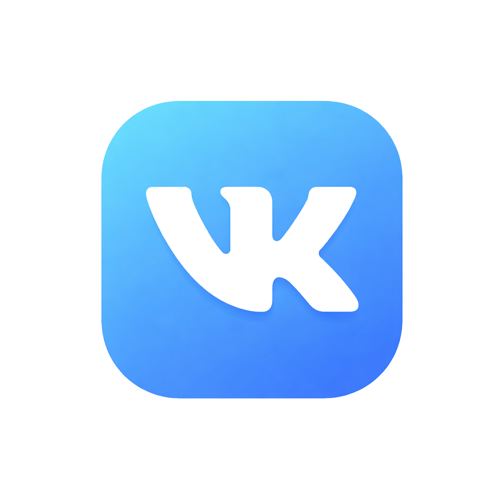
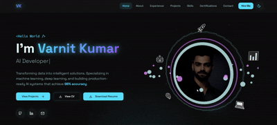

<div align="center">


</div>
<div align="center">


[](https://vk-syntax.vercel.app/)
[](https://linkedin.com/in/varnit-kumar)
[](mailto:kumar.varnit.16@gmail.com)

**A modern, performance-optimized portfolio with cinematic animations and 3D effects**



</div>

## ✨ Features

<table>
<tr>
<td width="33%" align="center">

<h3>⚡ Lightning Fast</h3>
<p>98+ Lighthouse score with optimized bundle</p>
</td>
<td width="33%" align="center">

<h3>🎨 3D Effects</h3>
<p>Magnetic interactions & depth animations</p>
</td>
<td width="33%" align="center">

<h3>📱 Responsive</h3>
<p>Perfect on all devices & screen sizes</p>
</td>
</tr>
<tr>
<td width="33%" align="center">

<h3>🌊 Cursor Effect</h3>
<p>Physics-based flowing water animation</p>
</td>
<td width="33%" align="center">

<h3>♿ Accessible</h3>
<p>WCAG 2.1 Level AA compliant</p>
</td>
<td width="33%" align="center">

<h3>🔍 SEO Ready</h3>
<p>Optimized for search engines</p>
</td>
</tr>
</table>

## 🛠️ Tech Stack

<div align="center">

### Core Technologies


### Libraries & Tools


</div>

<details>
<summary><b>📦 View Full Dependencies</b></summary>

| Category | Technologies |
|----------|-------------|
| **UI Framework** | React 18.3.1, TypeScript 5.5.3 |
| **Build Tool** | Vite 5.4.2 |
| **Styling** | Tailwind CSS 3.4.10, shadcn/ui |
| **Animation** | Framer Motion, React Spring |
| **3D Graphics** | Three.js, @react-three/fiber |
| **Routing** | React Router v6 |
| **Icons** | Lucide React |

</details>

## 🚀 Quick Start

```bash
# Clone the repository
git clone https://github.com/vannu07/vk-portfolio.git

# Navigate to directory
cd vk-portfolio

# Install dependencies
npm install

# Start development server
npm run dev
```

<div align="center">

**🌐 Open** `http://localhost:5173` **in your browser**

</div>

### 📜 Available Scripts

| Command | Description |
|---------|-------------|
| `npm run dev` | Start development server |
| `npm run build` | Build for production |
| `npm run preview` | Preview production build |
| `npm run lint` | Run ESLint |
| `npm test` | Run tests |

## 📊 Performance

<div align="center">


### Core Web Vitals

| Metric | Value | Status |
|--------|-------|--------|
| **LCP** | 1.8s | ✅ Excellent |
| **FID** | 45ms | ✅ Excellent |
| **CLS** | 0.05 | ✅ Excellent |

</div>

## 🎨 Key Highlights

- 🌊 **Flowing Water Cursor** - Physics-based spring animation
- 🎭 **Cinematic Transitions** - Professional micro-interactions
- 🧊 **Glass Morphism** - Modern UI design elements
- 🎯 **Magnetic Hover** - Interactive 3D depth effects
- 🎨 **Dynamic Backgrounds** - Adaptive visual responses
- ⚡ **60fps Rendering** - Buttery smooth performance

## 📁 Project Structure

```
vk-portfolio/
├── 📂 src/
│   ├── 📂 components/      # React components
│   ├── 📂 pages/          # Route pages
│   ├── 📂 hooks/          # Custom hooks
│   ├── 📂 data/           # Static content
│   └── 📂 styles/         # Global styles
├── 📂 public/             # Static assets
└── 📄 package.json        # Dependencies
```

## 🌐 Deployment

<div align="center">

[](https://vercel.com/new/clone?repository-url=https://github.com/vannu07/vk-portfolio)
[](https://app.netlify.com/start/deploy?repository=https://github.com/vannu07/vk-portfolio)

</div>

**Quick Deploy:**
```bash
npm run build
vercel --prod
```

## 🤝 Contributing

Contributions are welcome! Feel free to open issues or submit pull requests.

1. Fork the repository
2. Create your feature branch (`git checkout -b feature/amazing-feature`)
3. Commit your changes (`git commit -m 'feat: add amazing feature'`)
4. Push to the branch (`git push origin feature/amazing-feature`)
5. Open a Pull Request

## 📄 License

This project is licensed under the MIT License - see the [LICENSE](LICENSE) file for details.

---

<div align="center">

### 👨‍💻 About Me

**Varnit Kumar** | Full Stack Developer

[](https://github.com/vannu07)
[](https://linkedin.com/in/varnit-kumar)
[](https://vk-syntax.vercel.app)

---

### 💖 Support This Project

If you found this helpful, consider:

⭐ **Star the repo** • 🐛 **Report bugs** • 💡 **Suggest features** • 📢 **Share with others**

[](https://github.com/vannu07/vk-portfolio/stargazers)
[](https://github.com/vannu07/vk-portfolio/network/members)

---

**Made with ❤️ by Varnit Kumar**

[🔝 Back to Top](#-vk-portfolio)

</div>
<div align="center">

</div>
